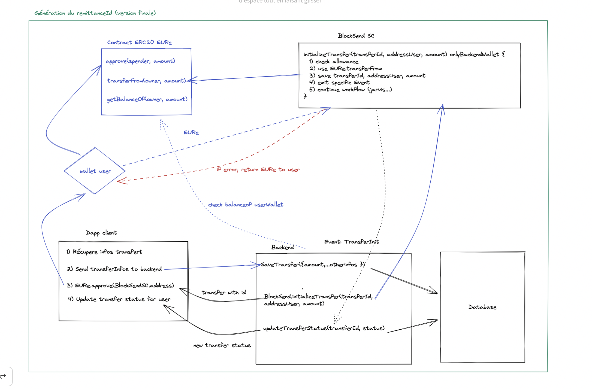

# Blocksend

## Presentation

BlockSend allow you to send money abroad with reduce fees and transparency. The application used the blockchain technology to transfer value without slippage and with a low cost.

## Context

This project is the final project for the Alyra certification, the subject was free but must used blockchain technology.

## Objective

The objective was to have a simple application that allow user to send money abroad with a low cost and transparency. We build simple interface allow the user to add contact and then program a transaction.

## Organization
To share, organize, collaborate and track the progress of the project:
- [Board Trello](https://trello.com/b/18tZQRRh/blocksend-suivi-dev)
- [Confluence for doc](https://blocksend.atlassian.net/wiki/spaces/BLOCKSEND/pages/426049/Sommaire)
- [design with Figma](https://www.figma.com/file/V8fQ5aJYz9IreIc5WkJLf7/ASHLEY_WK_061222?node-id=0%3A1)

## Architecture

We choose to have an hybrid architecture with a smart contract on the blockchain and a backend to store some confidential data in a centralised database.



## Getting Started

1. Install test and solidity dependencies
    ```
    npm install
    ```
1. Install [Truffle](http://truffleframework.com)
    ```
    npm install -g truffle
    ```
1. Migrate the contracts with truffle.
    ```
    truffle migrate --network 'network_name'
    ```
1. Run the webpack server for front-end hot reloading
    ```
    npm run dev
    ```

## Tests
This box comes with `truffle` contracts testing and front-end testing with `jest`
1. Truffle contract tests
    ```
    truffle test
    ```

## Building for Production
1. Migrate the contracts with truffle.
    ```
    truffle migrate --network 'network_name'
    ```
1. Create production bundle
    ```
    npm run build
    ```
1. The production build will be compiled in the `build/app` folder.
    
    
## Realization

### Smart Contracts

#### BlockSend Token
An ERC20 stndard token that the users can claim as a rewards for their tranfers.

#### BlockSend Router
The main contract which contains the business logic of the remittance.
it allows money to be routed from the user wallet to the off-ramp solution (HUB2 in our architecture).
Money routing is done in several steps:
- Transfer of EURe from the user's wallet after prior approval.
- Wrapping EURe in jEUR with Jarvis Wrapper.
- Redeem USDC with jEUR via Jarvis Syntherium.
- Calculate the BlockSend fees to be charged taking into account the network fees that BlockSend bears.
- Calculate the rewards that will be redistributed after the stacking of the rewards.
- Sent the UCDS to the Off-Ramp solution with the additional info sent from the BackEnd.

#### BlockSend Stacking

### Front end

### Back end

### Unit tests

