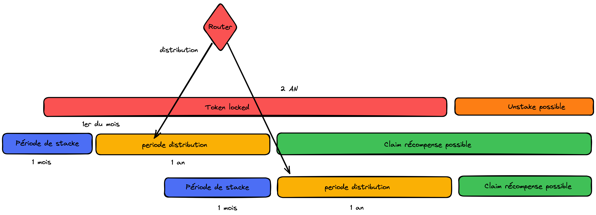

# Blocksend

## Presentation

BlockSend allow you to send money abroad with reduce fees and transparency. The application used the blockchain technology to transfer value without slippage and with a low cost.

## Context

This project was done for the the Alyra certification (Blockchain school), the subject was free but must used blockchain technology and some technical figures were imposed.

### Collaborators

We are a team of 6 people, we have a 2 developers ([Ayoub ZGUAID](https://github.com/zguaid) and [Fabrice PAYET](https://github.com/fabricepayet)), and 4 consultants (Élodie, Rafael, Ashley and Anis).

## Objective

The objective was to have an application that allow user to send money abroad with a low cost and transparency. We build simple interface to add contacts and configure a transfer.

## Organization

To share, organize, collaborate and track the progress of the project:
    - [Board Trello](https://trello.com/b/18tZQRRh/blocksend-suivi-dev)
    - [Confluence for doc](https://blocksend.atlassian.net/wiki/spaces/BLOCKSEND/pages/426049/Sommaire)
    - [design with Figma](https://www.figma.com/file/V8fQ5aJYz9IreIc5WkJLf7/ASHLEY_WK_061222?node-id=0%3A1)

We have a daily technical meeting every day at 5pm. We use Discord to communicate with others team members.
We organized the trello as a Kanban board, describing the differents steps of our workflow (to do, in progress, code review, test, etc...)


## Architecture

We choose to have an hybrid architecture with a smart contract on the blockchain and a backend to store some confidential data in a centralised database. The user will allow the smart contract to transfer their EURe and the backend will detect when the user have a sufficient balance to make the onchain transfer.


## Getting Started

 1. Install test and solidity dependencies

```
npm install
```

2. Install [Truffle](http://truffleframework.com)

```
npm install -g truffle
```

3. Migrate the contracts with truffle.

```
truffle migrate --network 'network_name'
```

4. Run the webpack server for front-end hot reloading

```
npm run dev
```

## Tests

This box comes with `truffle` contracts testing and front-end testing with `jest`

1. Truffle contract tests

```js
truffle test
```

## Building for Production

The dapp is deployed on Matic mainnet. Here the addresses of the contracts:

```js
BlockSendToken address: 0xF942FF4024F90233E50aC47C1E8Bd36fCbf2f3a8
BlockSendRouter address: 0x5Ebec560AF9FDd6d7ceCe6dB74afd8Ed4f35979c
BlockSendStakingRewards address: 0x922330Ea0B38Cf27645ed6E3080222136508d4A2
```

The dapp is accessible here : [BlockSend](https://www.blocksend.fi/)

[Example of an onchain transfer](https://polygonscan.com/tx/0x8521efe5578e4c0963eabcf541a503633623e0814e2b66cf893fc0647d4a8c90)

1. Migrate the contracts with truffle.

```js
truffle migrate --network 'network_name'
```

1. Create production bundle

```js
npm run build
```

1. The production build will be compiled in the `build/app` folder.

## Realization

### Smart Contracts

We have three smart contracts that interact with each other, the SC BlockSendRouter is the only minter of the token so that we guarantee that the token is minted correctly when the user makes a claim of his rewards from the Router.
The SC Router is also responsible for transferring the rewards that the stackers will share at the end of the stacking period


#### BlockSend Token

An ERC20 stndard token that the users can claim as a rewards for their tranfers.

#### BlockSend Router

The main contract that handles the business logic of the remittance.
it allows money to be routed from the user wallet to the off-ramp solution (HUB2 in our architecture).
Money routing is done in several steps:
    - Transfer of EURe from the user's wallet after prior approval.
    - Wrapping EURe in jEUR with Jarvis Wrapper.
    - Redeem USDC with jEUR via Jarvis Syntherium.
    - Calculate the BlockSend fees to be charged taking into account the network fees that BlockSend bears.
    - Calculate the rewards that will be redistributed after the stacking of the rewards.
    - Sent the UCDC to the Off-Ramp solution with the additional info sent from the BackEnd.

#### BlockSend Stacking

The contract that handle the stacking the tokens and redistributing the rewards to the stackers.



### Front end

We build a frontend with ReactJs and NextJS. We used the library Wagmi and EthersJs to interact with the smart contract.

### Back end

We have a backend with NodeJs and NestJs. We have a centralized datatabase to store personal data (RGPD). A match between the onchain transfer and the data stored in backend is done, and when the transfer onchain is completed a notification is sent to the offchain provider (HUB2).

### Unit tests

```js
Contract: BlockSendStakingRewards
    ✔ Test stack revert (1066ms)
    ✔ Test unstack revert too soon (119ms)
    ✔ Test unstack revert no staked tokens (114ms)
    ✔ Test claim rewards revert too soon to claim rewards (114ms)
    ✔ Test unstack revert No staked tokens (110ms)
    ✔ Test on only router (38ms)
    ✔ Test add rawards revert (202ms)
    ✔️ check unstack done  (202ms)
```

```js
Contract: BlockSendToken
    ✔ has a name
    ✔ has a symbol
    ✔ has a decimal
    ✔ check first balance
    ✔ check balance after transfer (302ms)
    ✔ check approval done (94ms)
    ✔ check if transferFrom done (381ms)
    ✔ check mint done (150ms)
Only minter can mint
    ✔ check only minter done (946ms)
Pausable: paused
    ✔ check pause and unpause done (91ms)
    ✔ check pause and unpause done (291ms)


  11 passing (5s)
```
